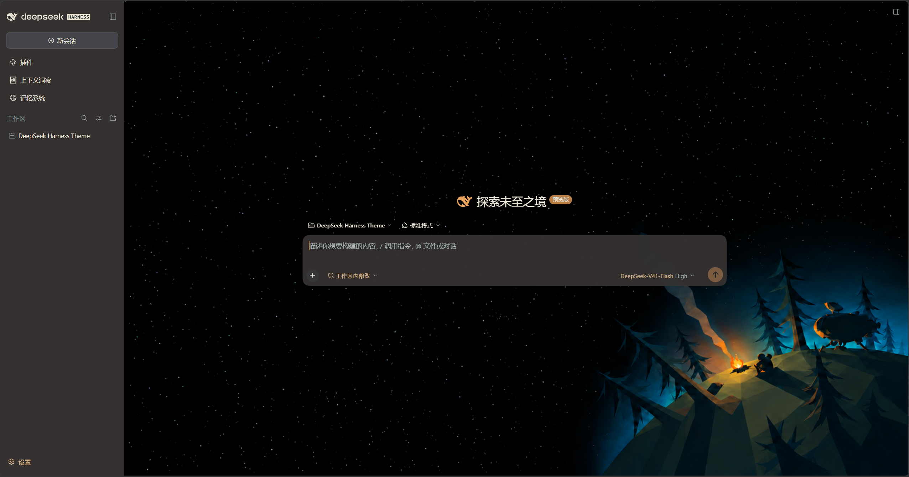

# dsh-outerwilds-theme

一个以《星际拓荒》（Outer Wilds）为主题的 DeepSeek Harness（DSH）外观插件。在篝火和星空下，继续聊天、写代码和整理想法。



- 篝火、烟雾和零星火星的小动效，也可以切换成完全静止。
- 背景随窗口大小调整，营地保持在右下角。
- 可以调整背景亮度、星星数量、面板透明度、字号和布局密度。
- 支持 DSH Web 和 Windows Desktop。
- 侧边栏采用暖橙导航、米白选中反馈、细虚线分组和更接近游戏菜单的粗体字样，保留 DSH 的紧凑布局。
- 英文使用 Jost，中文使用思源黑体，字体随插件提供，无需在线加载。来源见 [字体说明](FONTS.md)。

当前源码版本是 **0.1.3**，设置入口显示为“星际拓荒”。本版本增加侧栏音频显示屏和随插件提供的 Windows x64 系统音频组件。用户已在本地 Web 与 Windows Desktop 测试迭代中确认波形、显示屏样式和设置控制方式，并于 2026-10-10 同意完成开发与正式发布。设备切换等情况仍需按实际使用环境验证；其他系统和 DSH 版本还没有验证。更新内容见 [CHANGELOG](CHANGELOG.md)。

开发与正式发布约定见仓库中的 [发布流程](https://github.com/xikan0/dsh-outerwilds-theme/blob/main/docs/release-workflow.md)。

## 安装和启用

可以从 npm 按包名安装，也可以从 [Releases](https://github.com/xikan0/dsh-outerwilds-theme/releases) 下载 `.tgz` 安装包。

### Web

先安装 DSH，并确保终端能运行 `dsh`。在终端运行：

```powershell
dsh plugin --profile web add dsh-outerwilds-theme@0.1.3
dsh web
```

如果使用本地安装包，把命令中的包名替换为实际文件路径，例如 `./dsh-outerwilds-theme-0.1.3.tgz`。如果 Web 已经运行，安装后需要重启。

### Harness Desktop

如果你的版本提供插件管理入口，在侧栏打开 **插件 → 添加插件**，填入 `dsh-outerwilds-theme@0.1.3`，注册表选择官方 npm。使用本地安装包时填入完整路径，例如 `C:/Downloads/dsh-outerwilds-theme-0.1.3.tgz`。安装并启用插件后，完全退出应用（包括托盘）并重新打开。

桌面版和 Web 的插件安装位置不同。命令安装请参考 [DSH 官方桌面端说明](https://github.com/deepseek-ai/deepseek-harness/blob/master/apps/desktop/README.zh.md#bundled-command-runtime)，使用桌面版随附的命令；旧版本可能不支持该方式，不要用 npm 版 `dsh` 修改桌面端的插件目录。

如果使用桌面版随附的 `dsh` 命令，先完全退出 Desktop，再运行：

```powershell
dsh plugin --profile desktop add dsh-outerwilds-theme@0.1.3
```

安装后重新打开 Desktop。

### 启用主题

安装并启用插件后，设置侧边栏会出现 **星际拓荒**。这个入口会在主题背景关闭时保留。

打开 **设置 → 星际拓荒 → 启用深色主题**。首次安装的主题背景默认关闭，点击后才会显示。

建议关闭其他完整主题、壁纸和自定义配色，以免相互覆盖。切换到浅色时，篝火场景会自动停用。

## 调整外观

| 设置 | 可以做什么 |
| --- | --- |
| 背景亮度 | 调整整个背景的明暗，默认 35% |
| 星星数量 | 少、标准、多；调整的是插画外的扩展星空 |
| 动效强度 | 静止、轻微、增强；只影响营地，星空始终静止 |
| 面板不透明度 | 调整输入框和菜单的透明程度，默认 96% |
| 正文字号 | 与 DSH 原生字号同步 |
| 布局密度 | 舒适或紧凑 |
| 音频响应 | 默认关闭并隐藏侧栏模块；开启后显示设置按钮上方的显示屏，自动监听系统声音，首页和聊天中均保留。选择自动保存，重启后保留 |

音频响应保持增益 0.7、收束 250 ms、高度 100%。进入 **设置 → 星际拓荒 → 音频响应 → 开启** 后，Windows x64 自动读取 DSH 所在电脑的播放声音，无需选择共享页面。侧栏显示屏只展示频谱，不提供点击或键盘开关；开启和关闭统一在设置中完成。关闭音频响应会隐藏模块并断开声音来源。原生采集组件已经包含在插件内，不需要另外安装程序。旧版已经保存的自动监听选择会继续生效。

非 Windows x64 主机开启模块后会显示不支持自动监听的提示，模块不会弹出共享请求。远程浏览器使用自动模式时，响应的是运行 DSH 那台电脑的声音。组件和生命周期细节见 [Windows 音频说明](NATIVE-AUDIO.md)。

设置修改后会立即预览。“恢复主题默认”会重置主题参数，保留启用状态和正文字号。

三个滑块均支持点击两侧箭头逐步调节，或在右侧数值框直接输入。手动输入后按 Enter 或移开焦点生效，按 Esc 取消；超出范围的数值会自动限制到边界，空值恢复原值。

## 插件外观兼容范围

主题通过 DSH 公共主题变量统一暖灰面板、米白文字和橙色强调。使用这些变量与 DSH 公共组件的插件通常会跟随配色，不必逐个添加主题补丁。现有 Market 主体通过这一方式跟随主题。

Context 的独立页面另有阅读底色和星空背景适配。写死颜色、自行设计控件或使用独立页面的插件，仍可能需要局部处理；公共配色不保证任意插件都自动具备完整的星空背景和透明效果。警告、成功等状态颜色保留原有含义。

Web 迭代审查时，助手只安装并启动或重启测试服务，使用 `--no-open` 关闭自动打开浏览器，由用户自行打开页面并审查。

## 卸载

Web 端先关闭主题，再运行：

```powershell
dsh plugin --profile web remove dsh-outerwilds-theme
```

重启 Web 后生效。Desktop 请通过桌面应用自己的插件管理方式移除，再完全退出并重开。

## 想自己改一改

下载源码后，在项目目录运行：

```powershell
npm ci
npm run typecheck
npm test
npm run build
npm pack
```

`npm run preview` 可以启动本地样例页，地址是 `http://127.0.0.1:3092`。它用来预览主题，不会调用模型。

## 关于素材

这是免费的非官方主题。软件代码采用 [MIT 许可](LICENSE)，背景图片不包含在 MIT 许可内。素材参考见 [ARTWORK.md](ARTWORK.md)。

